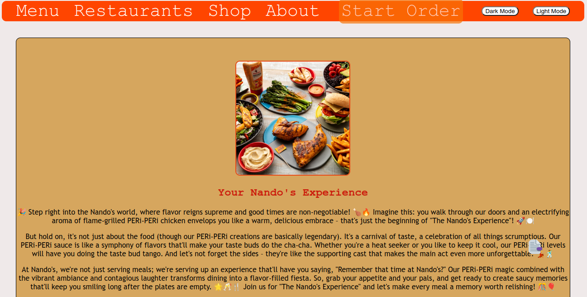
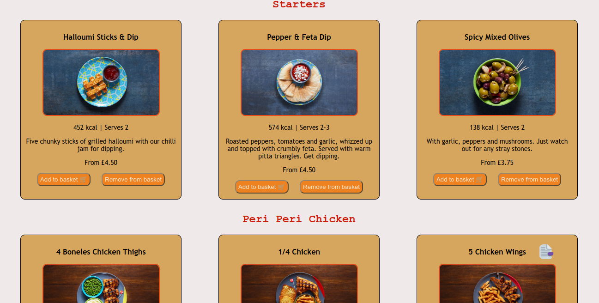

# TEAM SPICY CHICKENS- Shop landing page assessment day solution

## The Team
Owen Rami
Sarah Ogunko
Joel ...
Chuba Mezue

## Table of contents

- [Introduction](#Introduction)
- [Screenshot](#screenshot)
  - [Links](#links)
- [The process](#The-process)
  - [What We learned](#what-We-learned)
  - [Continued development](#continued-development)
  - [Useful resources](#useful-resources)

## Introduction

Our plan was to make a landing page for the nandos restaurant. 

## Screenshot

## The process

To solve this problem we broke it down into manageable steps:
- We used Google docs to create a plan and a rough sketch of the webpage
- Next, we focused on creating the HTML
- Once completed, we then went on to style the page with CSS and JavaScript

### What We learned
- HTML, CSS, JavaScript
- Organisation and Planning
- Task Management 
- Web Developement

### Continued development
We all thoroughly enjoyed this project and we gained a strong fundamental understanding of web developement. The next step is to keep this momentum and continue the journey of learning and applying our skills!

### Useful resources
- [Guide to Flexbox](https://css-tricks.com/snippets/css/a-guide-to-flexbox/) - This helped me understand how to use flexbox to format my navigation bar.
- [Nando's Website](https://www.nandos.co.uk/food/menu/) - Without this website, we would be nothing.

